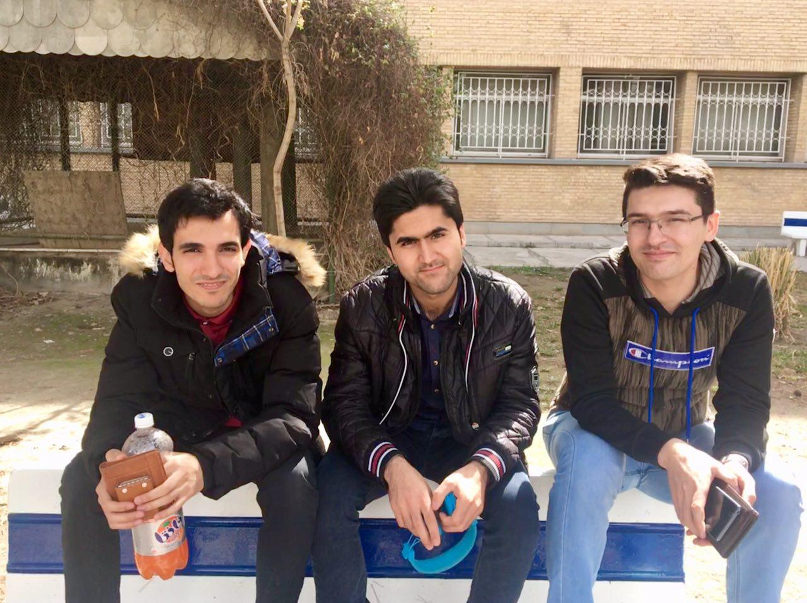
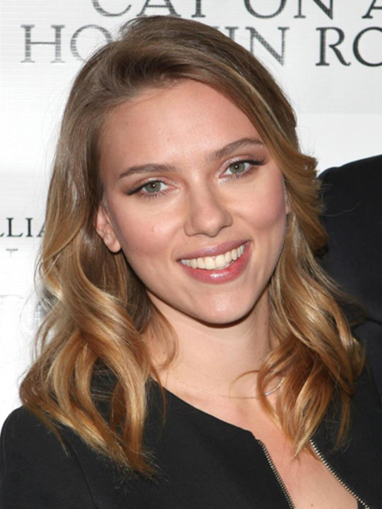
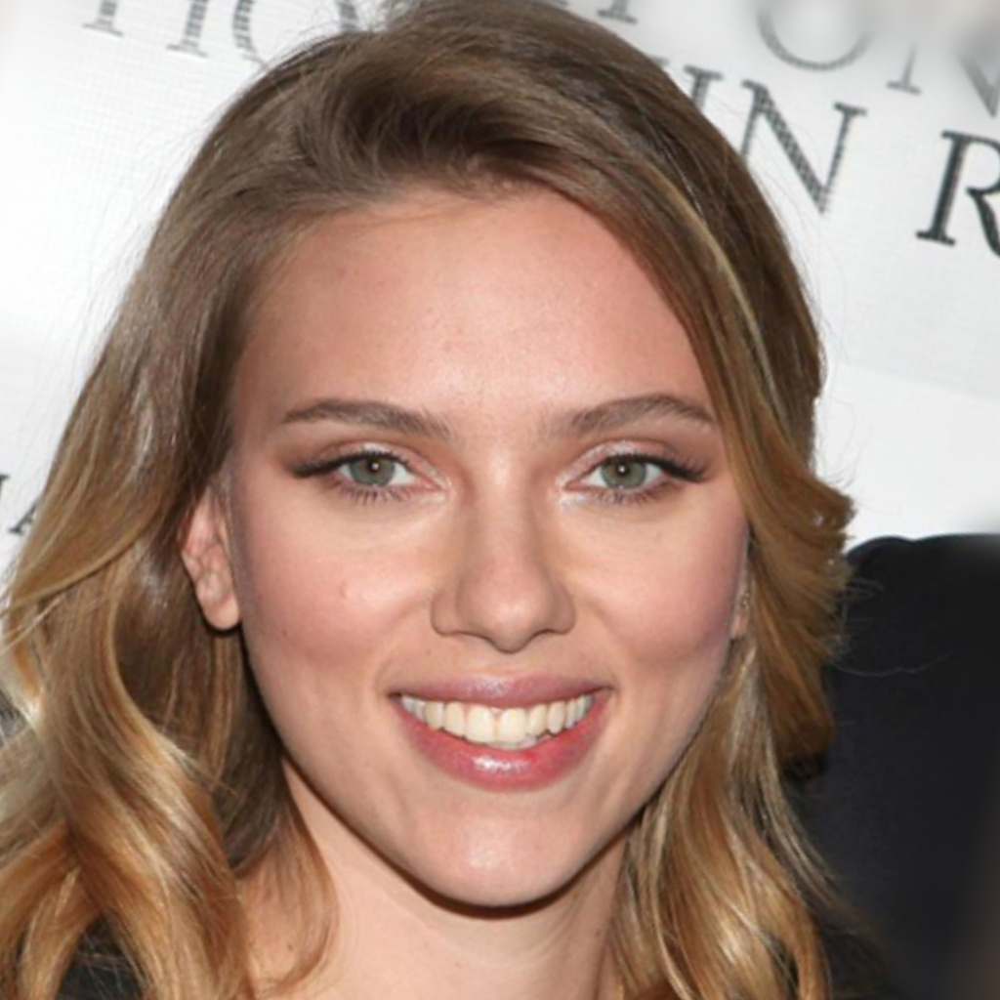

# Face Alignment

Face Alignment using python

Input Image | Aligned Face | Aligned Face | Aligned Face  |
--- | --- | --- | --- |
 |  |  |  |

Input Image | Aligned Face | Input Image | Aligned Face  |
--- | --- | --- | --- |
 |  |  |  |


## Installation

Install required packages
```
pip install -r requirements.txt
```


## Inference

This code processes an image or a directory of images and save output to a directory:

```
python3 align_image.py --input ./input/friends.jpg --output ./output
python3 align_image.py --input ./input --output ./output
```

or run following command to align face image using imutils package:
```
python3 align_image_2.py --input ./input/friends.jpg --output ./output
```
